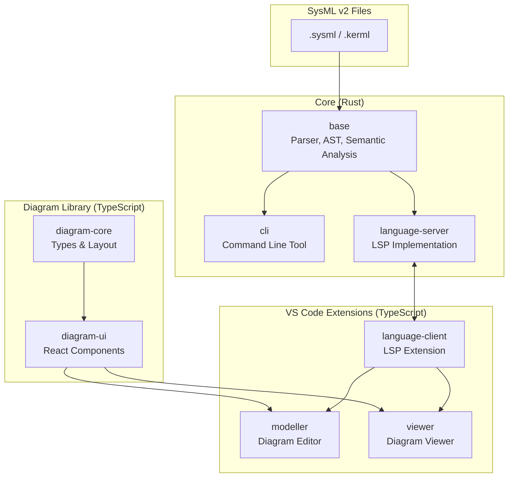

# Syster

**Status: Alpha** - Active development, APIs may change

A Rust-based parser and tooling for SysML v2 (Systems Modeling Language) and KerML (Kernel Modeling Language).

## Architecture



## Repository Structure

Feature-based organization with independent submodules for versioning flexibility.

```
syster/
├── base/                  # Parser, AST, semantic analysis
├── cli/                   # Command-line tool
├── language-server/       # Language Server Protocol implementation
├── language-client/       # VS Code LSP extension
├── modeller/              # VS Code modeller extension
├── viewer/                # VS Code viewer extension
├── diagram-core/          # Diagram types and layout (TypeScript)
├── diagram-ui/            # React Flow components (TypeScript)
└── pipelines/             # CI/CD pipeline templates
```

### Components

| Feature | Path | Repository | Description |
|---------|------|------------|-------------|
| **Base** | `base/` | [syster-base](https://github.com/jade-codes/syster-base) | Parser, AST, semantic analysis |
| **CLI** | `cli/` | [syster-cli](https://github.com/jade-codes/syster-cli) | Command-line tool |
| **LSP Server** | `language-server/` | [syster-lsp](https://github.com/jade-codes/syster-lsp) | Language Server Protocol |
| **LSP Client** | `language-client/` | [syster-vscode-lsp](https://github.com/jade-codes/syster-vscode-lsp) | VS Code language support |
| **Diagram Core** | `diagram-core/` | [syster-diagram-core](https://github.com/jade-codes/syster-diagram-core) | Diagram types (TS) |
| **Diagram UI** | `diagram-ui/` | [syster-diagram-ui](https://github.com/jade-codes/syster-diagram-ui) | React Flow components |
| **Modeller** | `modeller/` | [syster-vscode-modeller](https://github.com/jade-codes/syster-vscode-modeller) | VS Code modeller |
| **Viewer** | `viewer/` | [syster-vscode-viewer](https://github.com/jade-codes/syster-vscode-viewer) | VS Code viewer |
| **Pipelines** | `pipelines/` | [syster-pipelines](https://github.com/jade-codes/syster-pipelines) | CI/CD templates |

## Getting Started

### Dev Container (Recommended)

This repository includes a VS Code dev container with all development tools pre-installed:

1. Open the repository in VS Code
2. When prompted, click "Reopen in Container" (or run `Dev Containers: Reopen in Container` from the command palette)
3. The container will automatically:
   - Initialize all git submodules
   - Install Rust, Node.js, and Bun
   - Set up dependencies

### Clone with Submodules

```bash
# Clone with all submodules
git clone --recurse-submodules https://github.com/jade-codes/syster.git

# Or if already cloned, initialize submodules
git submodule update --init --recursive
```

### Build

Each submodule is built independently. Navigate to the submodule directory and follow its README:

```bash
# Build the base parser
cd base && cargo build && cargo test

# Build the CLI
cd cli && cargo build

# Build the LSP server
cd language-server && cargo build

# Build VS Code extensions
cd language-client && npm install && npm run compile
cd modeller && npm install && npm run compile
cd viewer && npm install && npm run compile
```

### Running the VS Code Extension Locally

1. Build the LSP binary:
   ```bash
   cd language-server && cargo build --release
   ```

2. Build the extension:
   ```bash
   cd language-client && npm install && npm run esbuild
   ```

3. Press `F5` in VS Code to launch the extension in a new window

## Documentation

Documentation lives in each component's repository:

- **[syster-base](https://github.com/jade-codes/syster-base)** - Core architecture, SysML primer, contributing guide
- **[syster-lsp](https://github.com/jade-codes/syster-lsp)** - LSP features and VS Code extension usage

## License

MIT License - see [LICENSE.md](LICENSE.md)
